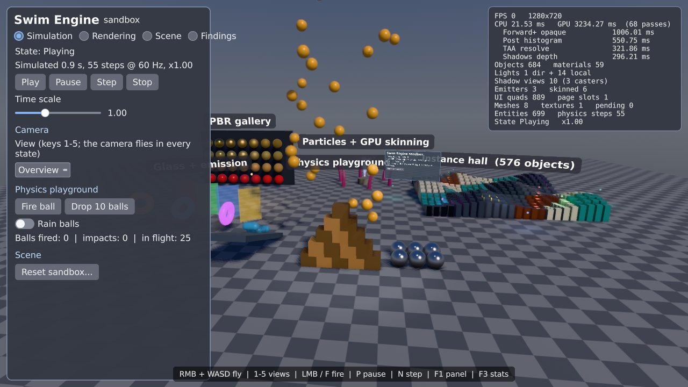
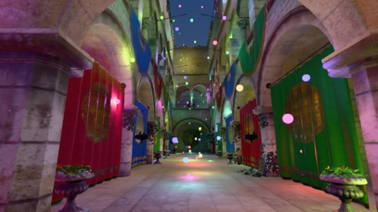
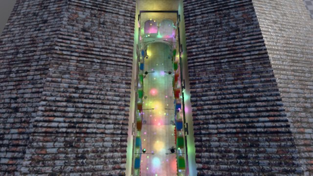

# Engine runtime (Phases 22 and 23)

This page describes the assembled Swim Engine runtime: what `Swim Engine` constructs, how one frame runs, how scenes, behaviours, engine state and time work, the rendering and UI path, the sandbox demo and what is still missing. Phase 22 removed OpenGL and the editor. Phase 23 replaced the transitional `VulkanRenderer` and its resource pools with the modern renderer. The removed code is archived under [`Deprecated/`](../Deprecated/README.md).



## What the engine owns

`Engine::SwimEngine` (`Source/Engine/SwimEngine.h`) owns every runtime service directly. There is no service locator and no system manager.

| Owner | Contents |
| --- | --- |
| Platform | `PlatformSystem` (SDL3). The engine window is omitted with `--headless`, which uses SDL's offscreen video driver for the Vulkan loader. |
| Core services | `JobSystem` (enkiTS), `AsyncIoService`, `AssetSystem`, `FrameArena`, `InputSystem`, `CommandRegistry` |
| Runtime state | `EngineStateMachine` (Playing / Paused / Stopped), `SimulationClock`, `TagRegistry` |
| Simulation | `PhysicsSystem` (PhysX or Jolt), `CameraSystem` (main camera), `SceneSystem` (scene catalog, behaviour registry, active scene) |
| Rendering | `RenderDevice` (RHI Vulkan device, swapchain or headless), `FrameRenderer` (the frame graph and every GPU subsystem), `SceneRenderBridge` (ECS → GPU scene, lights, emitters, skins) |
| UI | `UiRuntime`: fonts, theme, glyph atlas, canvas router, input bridge and the UI draw list |

`RenderServices` (`Renderer/Runtime/RenderServices.h`) hands scenes the renderer, mesh and material libraries, settings, statistics, the render bridge and the UI runtime. With `--no-render` only the UI runtime is set (`HasRenderer()` is false). Scenes then build their entities without GPU meshes. Tests use this mode.

## One frame

`SwimEngine::Tick` runs these steps in order:

1. **Platform events.** Window events, then input events into `InputSystem`.
2. **Time.** The real frame delta (or `--fixed-delta`) goes into `input.AdvanceFrame()`, `frameArena.BeginFrame()` and `clock.Advance()`, which returns the frame's `SimulationFrame`: real delta, scaled delta, fixed step count, alpha and the paused/stepped flags.
3. **Scene `BeginFrame`.** A requested scene switch or Stop reset is applied here, then transform tracking starts.
4. **Renderer `BeginFrame`.** Waits for the previous GPU frame, reads its timings, retires resources, and updates residency and the material table.
5. **UI.** `UiRuntime::Sync` mirrors the scene's `UiCanvas` components. `ApplyInput` routes this frame's pointer, keyboard, text and gamepad input. The result says whether the UI owns the pointer or keyboard; the fly camera and the ball shooter check this.
6. **Fixed steps.** For each step: `SceneSystem::FixedUpdate` runs the behaviours' `FixedUpdate`, then `Scene::FixedUpdatePhysics` steps physics and dispatches collision callbacks to behaviours.
7. **Physics interpolation.** `UpdatePhysics(alpha)`.
8. **`Update`.** Behaviours get the Behaviors-domain delta: the scaled simulation delta, or the real delta for `UsesRealTime()` behaviours.
9. **Camera components**, then **render bridge** `Update`: transforms and renderables, lights and shadow slots, emitters, skinned instances.
10. **UI `Finish`.** Re-layout, animation and the draw list. World canvases come first, then screen canvases by order.
11. **`FrameRenderer::Render`**, then present, or export in headless mode. An optional capture reads back the final image.

## Engine state and time (Phase 22)

- **`EngineStateMachine`** holds exactly one of `Playing`, `Paused` or `Stopped`. `Play`, `Pause`, `Resume`, `Stop` and `TogglePause` return false when the transition is not allowed. Listeners see every transition in order and may unsubscribe while they are being notified. The initial state (`--state=`) is not a transition.
- **Stop** resets the active scene at the start of the next frame (Exit, then Init). **Play** always starts from that fresh state.
- **`SimulationClock`** provides:
  - a fixed-step accumulator (default 60 Hz), clamped for long frames, with the excess dropped and counted;
  - a time scale from 0 to 100;
  - pause;
  - single steps (`Step(n)`), which run exactly one fixed step per frame while paused;
  - per-domain participation: physics, animation, particles, behaviours and audio can each follow simulation time or real time.
- **Behaviours** run in the states of their entity's mask (`BehaviorComponents`; Playing by default).
  - A single step runs as Playing (`Scene::GetExecutionState`).
  - Real-time behaviours (the fly camera, the HUD) receive wall-clock deltas.
  - All behaviours receive `OnPlay`, `OnPause`, `OnResume` and `OnStop`, then the scene receives `OnStateChanged`.
  - Lifecycle: Awake on attach; Init before the first Update or FixedUpdate; Exit once, on removal or scene exit. Only behaviours that have run Init receive Exit.
- **Tags** are FNV-1a `TagId`s with display names in `TagRegistry`. An entity can have several tags (`TagSet`). The scene keeps an index (`GetEntitiesWithTag`, `CountWithTag`, `ForEachWithTag` over a snapshot), and tags can also change through the command buffer. `EntityName` supports `FindByName`.
- **The fly camera** is `Engine::FlyCameraController`, a real-time behaviour:
  - hold the right mouse button to look;
  - WASD to move, Space/Shift for up/down, Ctrl to boost;
  - the mouse wheel scales speed while looking.

  `FlyCameraController::Apply` is a pure function that the tests exercise directly.

## Rendering (Phase 23)

`FrameRenderer` (`Renderer/Runtime/FrameRenderer.cpp`) owns one RenderGraph per frame. The steps are:

- **Uploads:** a white fallback texture on the first frame, residency imports (`GeometryHeap`, `TextureResidency`), GPU skinning, the material table, the GPU scene and the GPU light buffer.
- **Persistent resources:** the BRDF LUT is built once. The environment (a prefiltered cube and irradiance) is rebuilt only when the sky changes.
- **Sky pass:** clears the seven Forward+ targets and depth, and draws the procedural sky.
- **Scene passes** (only when geometry pages exist):
  - shadow planning and `ShadowRenderer` (cascaded sun, spot and point atlas), using its own visibility instance;
  - GPU visibility (frustum and LOD culling, binning, compaction, indirect commands);
  - light clusters;
  - opaque and transparent clustered Forward+ with IBL and shadow sampling.
- **Effects:** GPU particles (simulate and draw), screen-space GTAO, SSR and height fog, then render features at `BeforeTemporal` (for example volumetric clouds), then TAA.
- **Render features** at `BeforePostProcess` (sun shafts, lens flare), see [Render features](RenderFeatures.md).
- **Post:** auto exposure, bloom, grading and tone mapping into an RGBA8 output, then render features at `AfterPostProcess`.
- **UI:** `UiRenderer` draws each canvas. World canvases are depth-tested and fade with distance.
- **Output:** a present pass onto the swapchain, or an export when headless. An optional capture readback writes a binary PPM.

Scenes feed the renderer through components that the `SceneRenderBridge` reads:

| Component | Purpose |
| --- | --- |
| `MeshRenderer` | Mesh parts (`MeshLibrary` handle and material id) and render flags |
| `Light` | Directional, point or spot: colour, intensity, range, cones, shadow casting and priority |
| `ParticleEmitter` | A `Swim::Render::ParticleEmitterDesc`. Bumping `Revision` rebuilds the emitter. |
| `SkinnedMeshRenderer` | A skinned mesh (registered with the bridge), a palette and `PoseRevision` |
| `UiCanvas` | A UI document as a screen overlay, world panel or billboard |
| `CameraComponent` | Drives the main camera from an entity |

`MeshLibrary` publishes procedural meshes as assets and streams them through `AssetResidencyService`. Its built-ins are box, plane, sphere, cylinder, cone, torus and capsule, plus skinned columns. `MaterialLibrary` builds GPU material table entries from `MaterialDesc`. `ShaderLibrary` loads the runtime shader set: 38 core programs plus the render-feature programs added with `swim_add_runtime_shader`, compiled from Slang at build time into `Shaders/Runtime` next to the executable (`SWIM_SHADER_DIR` overrides the location). Compute programs expose their descriptors by Slang parameter name, which is what `RenderFeatureContext::Compute` binds.

**Frame pacing.** `BeginFrame` no longer waits for the GPU: the previous frame keeps executing while the engine runs UI, gameplay, physics and render extraction for the next one, and `Render` waits for it right before acquiring and recording. One submission is still in flight at a time (the executor's contract); see [Performance analysis](PerformanceAnalysis.md) for the next step.

The indirect draw path uses `DrawIndexedIndirectCount` when the device supports it. It falls back to zero-filled `DrawIndexedIndirect` on SwiftShader (vendor 0x1AE0), with `SWIM_FORCE_INDIRECT_FALLBACK=1`, or with `FrameRendererDesc::ForceIndirectFallback`.

## Assets

Development builds read loose assets from the repository's `Assets/` folder directly: CMake bakes its path into the engine (`SWIM_DEVELOPMENT_ASSET_ROOT`), the engine cooks new or changed `.gltf`/`.glb` sources on startup into `Assets/Cooked/` next to them, and `SwimAssetCooker` (and `scripts/recook-sassets.*`) cooks the same folder. There is one cooked cache and nothing is copied next to the executable. `--assets=<dir>` overrides the root; `-DSWIM_DEPLOY_ASSETS=ON` copies `Assets/` next to the executable after each build for packaged runs (the engine then reads `<exe dir>/Assets`).

A cooked model is current when its compiler-profile hash and its source-file hashes match; otherwise it is re-cooked. Cook and load errors are printed as `[Assets] [stage] <file>: <message>`, and the sandbox lists the cooked models it found when no Sponza is among them.

## Running

```text
Swim Engine [options]
  --graphics=auto|vulkan              Graphics backend (auto = vulkan)
  --physics=auto|physx|jolt           Physics backend
  --state=playing|paused|stopped      Initial engine state
  --scene=<name>                      Startup scene
  --assets=<dir>                      Loose-asset root (default: the repository's Assets/)
  --size=<W>x<H>, --vsync=on|off      Window (vsync is off by default)
  --validation[=on|off]               GPU validation layers (on by default in Debug)
  --fixed-rate=<hz>, --time-scale=<x> Simulation clock
  --headless                          Render offscreen without a window
  --no-render                         Run without a GPU (simulation and UI logic only)
  --frames=<n>, --fixed-delta=<s>     Automation
  --capture=<file.ppm>                Save the last frame
  --exec=<command>                    Run a command after startup (repeatable)
```

Engine commands (for `--exec` and the command registry):

| Command | Effect |
| --- | --- |
| `play`, `pause`, `resume`, `stop` | Change the engine state |
| `step [n]` | Pause if playing, then run n single fixed steps |
| `timescale <x>` | Set the simulation time scale |
| `scene <name>`, `reload` | Switch scenes, or reset the active one, at the next frame |
| `capture [file.ppm]` | Capture the next rendered frame |
| `camera ex ey ez [tx ty tz]` | Place the main camera (scenes stop moving it) |
| `quit` | Exit |

The sandbox adds these commands:

| Command | Effect |
| --- | --- |
| `sandbox.drop <n>` | Drop balls on the physics playground |
| `sandbox.rain 0\|1` | Start or stop ball rain |
| `sandbox.fire` | Fire a ball from the camera |
| `sandbox.view <0-6>` | Jump to a camera bookmark |
| `sandbox.sun <elevation> <azimuth>` | Move the sun |
| `sandbox.tab <0-2>` | Select a panel tab |
| `sandbox.clouds <coverage>` | Volumetric cloud coverage 0..1 (0 turns the feature off) |
| `sandbox.sunfx 0\|1` | Sun shafts and lens flare off or on |
| `sandbox.hud 0\|1` | Hide or show all sandbox UI: the HUD and every world panel and label (what C toggles) |

Example: a deterministic 1280x720 offscreen capture of the physics playground:

```sh
"Swim Engine" --headless --size=1280x720 --frames=40 --fixed-delta=0.033 \
  --exec="sandbox.view 3" --exec="sandbox.drop 25" --capture=physics.ppm
```

## The sandbox demo

`Game::Sandbox` (`Source/Game/Scenes/Sandbox.cpp`) is the startup scene. It contains:

- **Camera:** a rig with the fly controller (all states) and a separate ball shooter (Playing only). There are seven bookmarks: Overview, PBR gallery, Instance hall, Physics, Fountain, Sponza atrium and Sponza from above (keys 1–7, a panel dropdown, or `sandbox.view`).
- **Lighting:** a checker-textured ground with a collider; a shadowed sun, spot and lantern; twelve orbiting coloured point lights in the instance hall.
- **Rendering playground:**
  - a 7×4 PBR gallery (metallic by roughness);
  - a 24×24 instance hall (576 objects);
  - glass panes (transparent);
  - emissive tori (bloom);
  - three GPU particle emitters (fountain, smoke, sparks);
  - six GPU-skinned tentacles.
- **Physics playground:** a box pyramid, a ramp with capsules, and spheres and cubes. You can drop balls, make them rain, fire them from the camera, or spawn shapes. Impacts are counted from collision callbacks.
- **World UI:** an interactive info panel in the world, and billboard labels (constant screen size) for each zone.
- **Control panel** (a screen canvas with tabs):
  - *Simulation:* play/pause/step/stop, time scale, camera bookmarks, physics actions, reset with a confirmation modal.
  - *Rendering:* every renderer switch, tone mapper, exposure, bloom, grading, sun, environment, debug view.
  - *Scene:* a filtered, virtualised entity list with details, focus and delete, and a spawn menu.

  The panel uses every widget kind: buttons, toggles, checkboxes, sliders with editable values, a radio group, dropdowns, a text field, a list view, a virtual list, a scroll area, a menu, tooltips and a modal.
- **Diagnostics overlay** (X): frame and GPU times, the costliest passes, scene counts (objects, lights, shadow views, emitters, skinned instances, entities) and residency.
- **Sponza and the light swarm:** behind the playgrounds (centered at z = −52, scaled to 30 m long) stands the Crytek Sponza, imported from the cooked model by `Game::SpawnCookedModel` (`Source/Game/ModelImport.*`). The GPU scene draws one material per object, so the importer regroups the model's 103 primitives by material (25 meshes, node transforms baked in, vertices compacted, tangents generated when missing) and builds the materials from the cooked material instances (factors, alpha mask, double-sidedness, all five texture slots). `Game::FindSponzaModel` picks `Assets/Models/Sponza/sponza-ktx-draco.glb` (Draco-compressed meshes, KTX2/Basis ETC1S textures, about 9 MB), then `sponza-ktx.glb`, then a glTF Sponza. The cooker decodes the Draco meshes and transcodes the Basis textures into RGBA8 mip chains on first start (`CompileKtx2Texture`), so the runtime needs neither codec. Inside the atrium, 256 coloured point lights with glowing orbs roam randomly: one `LightSwarm` behaviour steers each toward a random target inside the atrium box at its own speed (simulation time, so they freeze while paused). Without a cooked Sponza (or without a renderer) the swarm still runs in the same box.
   
- **Shortcuts** (when the UI does not own the keyboard): C all UI on/off (panel, diagnostics, help bar, world panels and labels), V the control panel only, X the diagnostics only, P pause/resume, N step, 1–7 views, F fire (hold to repeat) along the camera's view direction. The mouse never fires: the left button belongs to the UI, the right one to the fly camera.
- **Look:** a tropical afternoon (`Sandbox::ApplyTropicalLook`): a saturated blue zenith, a bright cyan horizon and a turquoise "sea" below the horizon (no grey or brown band anywhere), a tight golden sun, the hue-preserving PBR Neutral tone mapper with a little warmth, contrast and saturation, and a thin blue sea-air haze.
- **Atmosphere** (`Sandbox::AddAtmosphereFeatures`, render features): volumetric trade-wind cumulus (coverage 0.38, 420–1250 m, drifting with the wind), sun shafts and a lens flare. The Rendering tab toggles each and sets cloud coverage and shaft/flare intensity; `sandbox.clouds` and `sandbox.sunfx` do the same from the command line.
- **Colliders** are sized in the entity's local space and follow its Transform scale, like the mesh (`AddSphereBody` radius 0.5 and `AddBoxBody` half extents 0.5 for the unit builtin meshes).

## Tests

The Phase 22 and 23 tests are in `Source/Tests/Suites/Engine` and `Source/Tests/Suites/Game`:

| Suite | Covers |
| --- | --- |
| `Engine.StateMachine` | Transitions, rejected transitions, listener order and unsubscribe, names |
| `Engine.SimulationClock` | Accumulation, time scale, pause and single steps, the spiral guard, per-domain participation |
| `Engine.SceneRuntime` | A real headless engine (`--no-render`) with probe behaviours: lifecycle order, pause and step, time scale versus real-time behaviours, Stop reset and Play, initial states, deferred scene switches, the tag index and names, the command buffer, physics collisions, raycasts and pause, and scaled colliders resting on their surface plus initial velocities applied after the body exists |
| `Engine.UiRuntime` | Bundled fonts, draw-list order (world canvases, then screen canvases by order), hidden canvases, canvases following the scene |
| `Engine.Camera`, `Engine.FlyCamera` | Reverse-Z projection equal to the renderer's, view conventions, look, move, boost, wheel limits |
| `Engine.ProceduralMeshes` | Winding versus normals, tangent space, bounds and counts, mesh asset layout, skinned column weights |
| `Game.TentacleAnimator` | The skinning palette is a rigid chain of equal segments with a planted root |
| `Game.Sandbox` | The full sandbox runs headless: every playground built, balls fall and rest, impact counting, lifetimes, pause holding the world still, Stop restoring it, commands (sun, tabs, HUD, fire, views), single steps |
| `Game.Findings` | Every finding has a title, detail and a known status |

The GPU path is checked by headless captures. See [the Phase 22/23 validation record](validation/Phase22-23-2026-09-25.md).

## Findings

The list is kept in `Source/Game/Findings.cpp` (checked by `Game.Findings`) and copied here by `scripts/sync-findings-doc.py`. The sandbox no longer shows it in a tab.

<!-- findings:begin -->

| Status | Finding | Detail |
| --- | --- | --- |
| Fixed | Behaviour Exit ran twice on scene exit | InternalSceneExit called every behaviour's Exit and then DestroyAllEntities called it again. Scene exit now destroys the entities once, after the scene's own Exit, so every behaviour exits exactly once. |
| Fixed | Cached component pointers dangled | Behaviours cached their Transform pointer; EnTT moves components when storage grows, so the pointer could dangle. Behavior::GetTransform now looks the component up on every call. |
| Fixed | Single step did nothing for gameplay | Stepping while paused advanced physics but Playing-only behaviours stayed idle. Scenes now run a stepped frame under the Playing execution state (Scene::GetExecutionState). |
| Fixed | Stop kept the played-out scene | Stop now resets the active scene to its initial state at the start of the next frame (deferred, because Stop is often requested from a UI callback inside the scene update); Play starts from that fresh state. |
| Fixed | Headless runs had no Vulkan loader | The headless platform skipped SDL's video subsystem, which also provides the Vulkan loader. Headless now initialises video with SDL's offscreen driver (no display needed) and falls back to events only. |
| Workaround | Forward+ loads every target without Clear | With ForwardPlusTargets::Clear = false the opaque pass loads all seven colour targets and depth, so the sky pass that runs first clears all of them in the same render pass. |
| Workaround | Page slots must match exactly | Forward+ and shadows require the visibility bins to cover exactly the frame's page slots, so the runtime rebuilds its visibility instances whenever the number of GeometryHeap index pages in use changes. |
| Fixed | Sky constants exceeded 128 bytes | An inverse view-projection plus the sky parameters did not fit the guaranteed push-constant budget; the sky pass now passes the camera's frustum basis (three vectors) instead. |
| Fixed | Push-constant stage masks | Slang reflects push-constant ranges for both graphics stages; writes must name every stage of the range or the RHI rejects them. |
| Fixed | Timings before the first frame | RenderGraphExecutor::ReadTimings throws until a graph has executed; the frame renderer reads timings only after a submission. |
| Fixed | DrawParameters on software rasterisers | SV_VertexID/SV_InstanceID need the DrawParameters capability, which SwiftShader lacks. The UI, particle, sky and present shaders now use SV_VulkanVertexID/InstanceID: their draws start at vertex and instance 0, so the values are identical. |
| Workaround | SwiftShader draw-indirect-count stub | SwiftShader advertises drawIndirectCount but its vkCmdDrawIndexedIndirectCount draws nothing. The frame renderer selects the zero-filled DrawIndexedIndirect path on SwiftShader (or with SWIM_FORCE_INDIRECT_FALLBACK=1). |
| Fixed | EnTT const storage access | In EnTT 3.13, registry.storage<entt::entity>() on a const registry returns a pointer; entity counting now handles it. |
| Fixed | Billboards behind the camera stopped the engine | A constant-screen-size billboard whose anchor is behind the camera has no valid placement; the UI math throws and the exception ended the run. UiRuntime now skips such canvases for the frame (not drawn, not interactive). |
| Fixed | UI bindings reported initial values as changes | The HUD's value/checked/text watchers fired once on their first poll, which snapped the camera back to the first bookmark after a startup --exec. The first poll now only records the initial state. |
| Fixed | MSVC rejected a default-initialized initializer_list member | MeshSpawn::Tags was a std::initializer_list with a {} default member initializer: MSVC stops with C2797 (and the list would dangle after the braced initializer anyway). It is a std::vector now. |
| Workaround | One material per GPU scene object | Instances carry a single material set and the submesh material slot is not used by visibility or Forward+. Cooked models are regrouped by material at import (Sponza: 103 primitives become 25 meshes); per-submesh materials in the GPU scene would remove the regrouping. |
| Workaround | KTX2/Basis textures could not be uploaded | TextureResidency uploads uncompressed native mip chains only, so KHR_texture_basisu textures fell back to white. The cooker now transcodes Basis Universal KTX2 (ETC1S/BasisLZ and UASTC) into RGBA8 mip chains with the Basis transcoder (compiler-only; the runtime links none), and the sandbox loads the Draco + KTX2 Sponza GLB. Keeping the textures block-compressed (BC7) on the GPU needs block-aware uploads in the RHI and residency. |
| Fixed | PhysX contacts of destroyed bodies crashed the step | After a body is destroyed, PhysX still reports its lost-touch pairs with the released actor flagged as removed; resolving that actor (a virtual call) was an access violation once the sandbox's balls expired. Removed actors and shapes are skipped now, and the shared physics contract destroys a resting body to cover it. |
| Fixed | Swapchain rebuild before the first frame | Windows can request a resize before anything was submitted; the RHI requires a same-device retirement timeline for swapchain replacement and the frame failed. RenderDevice now passes an already-signalled timeline then. |
| Fixed | Sandbox colliders were scaled twice | The physics bridge multiplies collider sizes by the Transform's world scale, but the sandbox passed world-unit sizes to scaled entities: balls rested half sunk into the floor, stacked boxes overlapped and the ramp collider was nearly flat. Collider sizes are now mesh-local (radius 0.5, half extents 0.5 for the unit meshes) and a test pins a scaled sphere resting exactly on the floor. |
| Fixed | Fired balls dropped straight down | Adding the Rigidbody component creates the physics body at once, so SetInitialLinearVelocity called afterwards (the order BallShooter and ball rain use) was never applied. The bridge now applies pending initial velocities to existing bodies before the next step. |
| Fixed | Unlit screen tiles among many lights | Cluster light lists were capped at MaxLightsPerCluster and the rest dropped in index order, so over a dense swarm (especially seen from afar, where one cluster covers many lights) neighbouring clusters kept different subsets and showed as square, darker tiles (an overflowing 2^20 index pool made it worse). Clusters now keep a bitmask over every local light plus occupancy words: nothing is ever truncated, memory is bounded by clusters x lights / 8 bytes, and MaxLightsPerCluster is only the heatmap scale. |
| Fixed | Jagged shadows and cascade pops | Shadows compared a point-sampled 3x3 texel box (stair-stepped edges) and switched cascades abruptly. Sampling is now bilinear-weighted PCF (the box slides continuously over the texels), cascades cross-fade over the far 20 % of their range and the last one fades out, and cascades are 2048 texels over 70 m. |
| Fixed | Forward+ shaded hidden surfaces | The opaque pass rasterised both faces and discarded back faces in the shader, which disabled early depth testing, so every overlapping surface ran the full clustered lighting loop. A depth prepass now lays down the nearest depth and the shading pass tests it with early fragment tests and no depth writes, so each pixel is lit once. |
| Fixed | Development assets were copied next to the executable | Every engine build copied Assets/ beside the executable and the engine cooked into that copy, while the build scripts and SwimAssetCooker cooked the repository's Assets/Cooked: two caches, copies that only refreshed when the engine relinked, and deleted sources that lingered in the copy. Development builds now read and cook the repository's Assets/ directly (SWIM_DEVELOPMENT_ASSET_ROOT, --assets overrides it), cook/load errors and the cooked models found are logged, and SWIM_DEPLOY_ASSETS copies assets only for packaged runs. |
| Workaround | CPU and GPU frames ran back to back | FrameRenderer::BeginFrame waited for the previous frame before gameplay, physics and extraction ran, so a frame took about CPU + GPU time. The wait now happens right before the next frame is recorded, overlapping the game update with GPU work; recording is still serialized with the GPU (one submission in flight per executor). Two executors used alternately are the next step (docs/PerformanceAnalysis.md). |
| Open | Cooked asset validation is slow in Debug | Every start re-hashes every cooked .sasset to decide whether it is current; in Debug builds that takes minutes for Sponza's RGBA8 textures. Recording file sizes and times beside the hashes would skip unchanged files. |
| Open | Render surfaces are not mirrored yet | UiCanvas supports screen overlays, world panels and billboards; RenderSurface canvases (UI rendered into a texture sampled by a material) exist in the UI renderer but the runtime does not route them yet. |
| Open | Occlusion culling is not enabled | The runtime uses single-phase GPU frustum culling; the two-phase HZB occlusion path (HzbBuilder) is built and tested but not wired into the frame yet. |
| Open | Only validated on SwiftShader so far | The assembled runtime was built and captured on Linux with SwiftShader (no validation layer available there, about 3.5 s per frame). The four validation profiles, the RTX 4070 run and the 1080p pass budgets are still to be recorded. |
| Open | No HDR output toggle or device-loss recovery | The swapchain is SDR (BGRA8; vsync off by default, --vsync=on for FIFO). The post stack can tone map to HDR10/scRGB and the RHI supports HDR swapchains, but the runtime neither offers the toggle nor recreates the device after a loss. |
| Open | Physics backend and gravity are fixed at startup | --physics selects PhysX or Jolt at launch; switching from the panel would rebuild every body, and PhysicsWorld has no runtime gravity setter yet. |
| Open | Playground extras not built | No domino run, trigger volumes or per-body inspector yet; the entity browser shows names, tags and transforms. Entity context menus and camera bookmarks beyond the five presets are also missing. |
| Open | Shadow and debug-view controls are partial | The panel toggles shadows and shows the cluster heat map; cascade count, resolution, bias and cascade debug views, wireframe and overdraw views are not exposed. |
| Open | One procedural sky, no IBL map selection | The environment is built from the procedural sky (prefiltered cube + irradiance); loading HDR environment maps from assets waits for Phase 24 asset handling. |

<!-- findings:end -->
